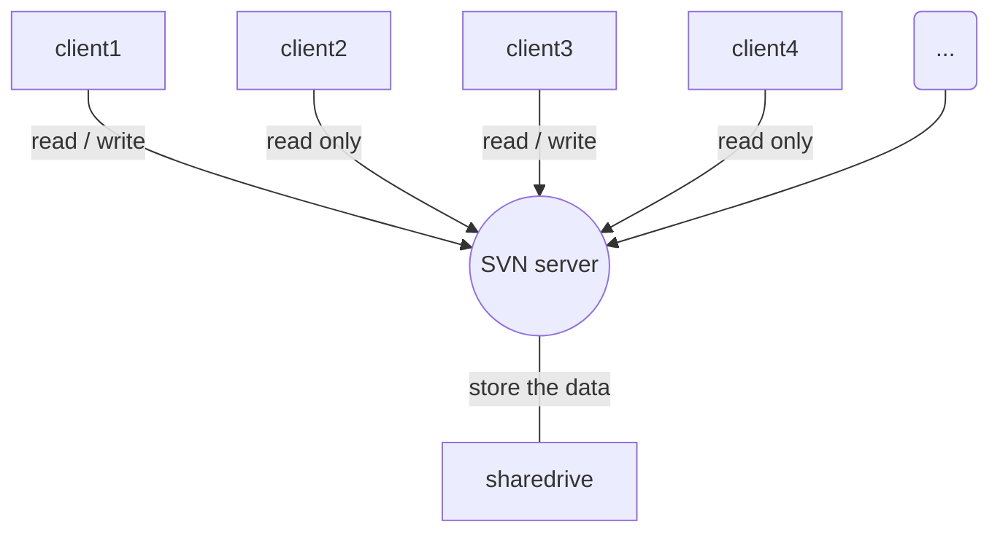

## Android通用框架设计与完整电商APP开发
---
* gogs 搭建git
* 单Activity架构,通过 fragmentation库实现
* AVLoadingIndicatorView 加载动画库

```mermaid
graph TD
client1-->|read / write|SVN((SVN server))
client2-->|read only|SVN
client3-->|read / write|SVN
client4-->|read only|SVN
client5(...)-->SVN
SVN---|store the data|sharedrive
```
